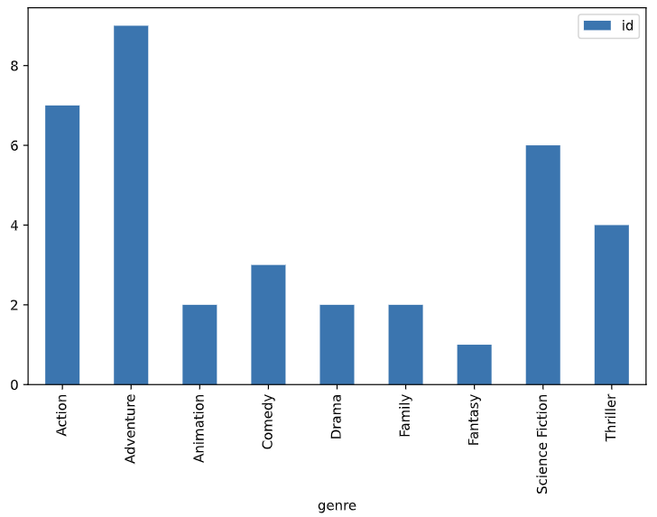
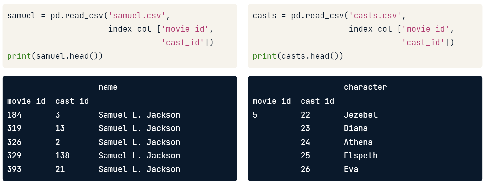
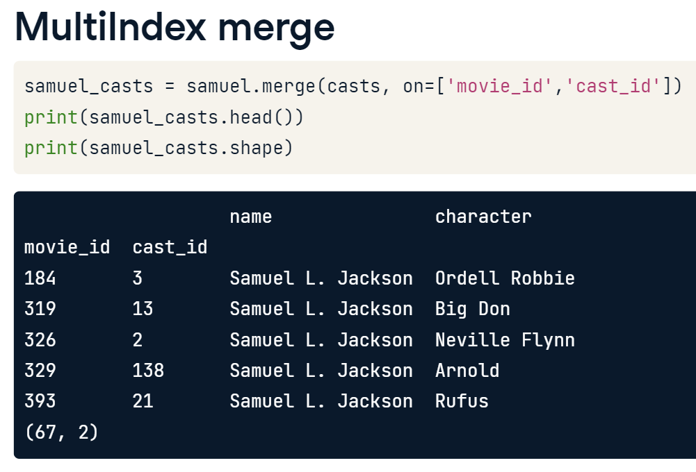
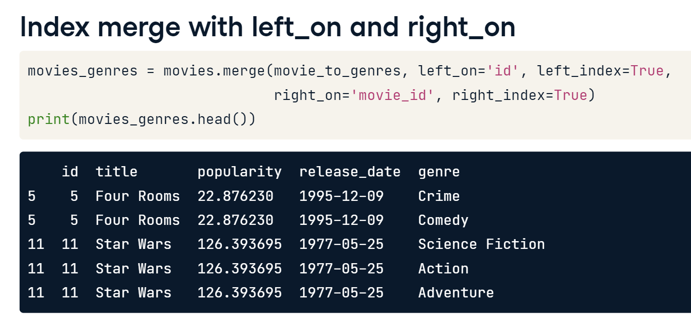
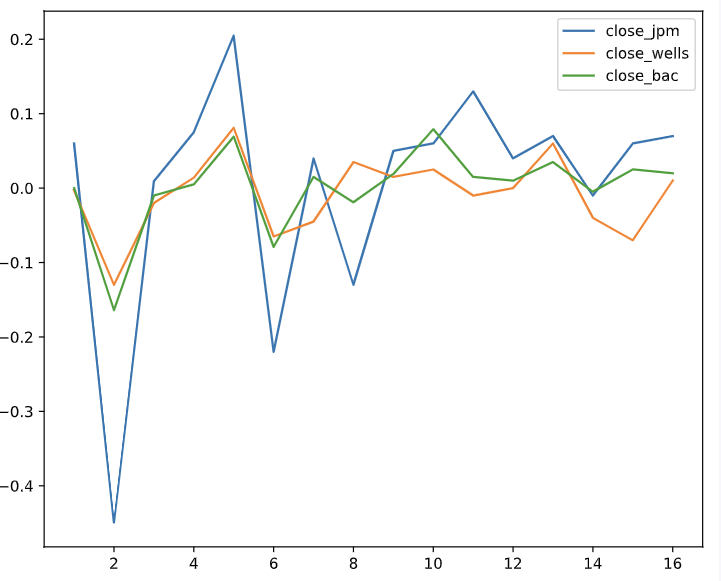
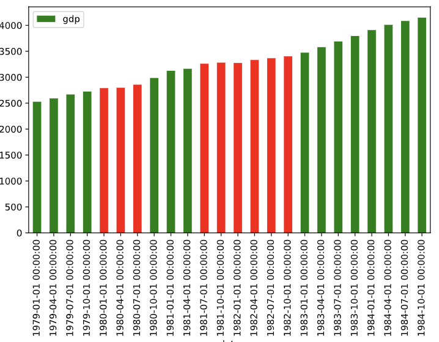
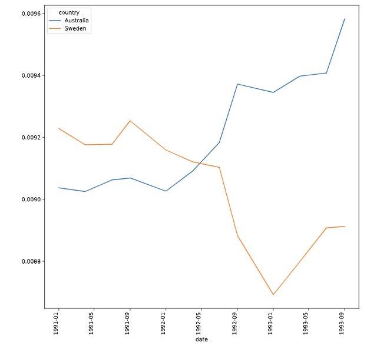
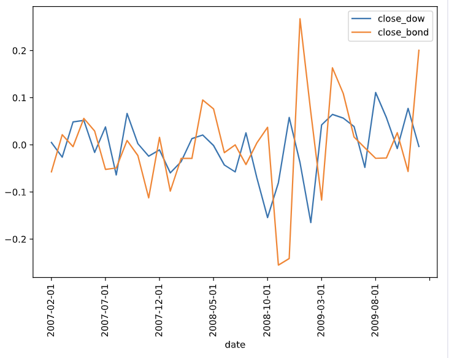

# Data camp Joining with Pandas

## Details

https://app.datacamp.com/learn/courses/joining-data-with-pandas

## Data Merging Basics

df1.merge(df2, on='col', suffixes = ('_df1', '_df2'))

```py

# example

taxi_own_veh = taxi_owners.merge(taxi_veh, on='vid', suffixes=('_own', '_veh'))

# Print the value_counts to find the most popular fuel_type
print(taxi_own_veh['fuel_type'].value_counts())
```

```py
# Merge the wards and census tables on the ward column
wards_census = wards.merge(census, on='ward')

# Print the shape of wards_census
print('wards_census table shape:', wards_census.shape)
```

### Relationships

One-to-one
One-to-many
Many-to-many

```py
# example

# Merge the licenses and biz_owners table on account
licenses_owners = licenses.merge(biz_owners, on='account')

# Group the results by title then count the number of accounts
counted_df = licenses_owners.groupby(['title']).agg({'account':'count'})

# Sort the counted_df in desending order
sorted_df = counted_df.sort_values(by='account', ascending=False)

# Use .head() method to print the first few rows of sorted_df
print(sorted_df.head())
```

```output

                 account
title                   
PRESIDENT           6259
SECRETARY           5205
SOLE PROPRIETOR     1658
OTHER               1200
VICE PRESIDENT       970
```

### Merging multiple dataframes

```py
## merging multiple tables

df1.merge(df2, on='col') \
    .merge(df3, on='col') \
        .merge(df4, on='col')

```
**example:**
```py

# example
# Merge the ridership, cal, and stations tables
ridership_cal_stations = ridership.merge(cal, on=['year','month','day']) \
							.merge(stations, on='station_id')

# Create a filter to filter ridership_cal_stations
filter_criteria = ((ridership_cal_stations['month'] == 7) 
                   & (ridership_cal_stations['day_type'] == 'Weekday') 
                   & (ridership_cal_stations['station_name'] == 'Wilson'))

# Use .loc and the filter to select for rides
print(ridership_cal_stations.loc[filter_criteria, 'rides'].sum())

```

**example: 
**
```py
# Merge licenses and zip_demo, on zip; and merge the wards on ward
licenses_zip_ward = licenses.merge(zip_demo, on='zip') \
            			.merge(wards, on='ward')

# Print the results by alderman and show median income
print(licenses_zip_ward.groupby(['alderman']).agg({'income':'median'}))
```
**Example**:


```py
# Merge land_use and census and merge result with licenses including suffixes
land_cen_lic = land_use.merge(census, on='ward') \
                    .merge(licenses, on='ward', suffixes=('_cen','_lic'))

# Group by ward, pop_2010, and vacant, then count the # of accounts
pop_vac_lic = land_cen_lic.groupby(['ward','pop_2010','vacant'], 
                                   as_index=False).agg({'account':'count'})

# Sort pop_vac_lic and print the results
sorted_pop_vac_lic = pop_vac_lic.sort_values(['vacant', 'account', 'pop_2010'], 
                                             ascending=[False,True,True])

# Print the top few rows of sorted_pop_vac_lic
print(sorted_pop_vac_lic.head())
```

## Merging Tables with Different Join Types

Left join takes first table (left) and rows which are matched in second table
* useful for 'enriching' a dataset

**example**

```py
# Merge the movies table with the financials table with a left join
movies_financials = movies.merge(financials, on='id', how='left')

# Count the number of rows in the budget column that are missing
number_of_missing_fin = movies_financials['budget'].isnull().sum()

# Print the number of movies missing financials
print(number_of_missing_fin)
```

**right join**

* same as left join, just other way - all rows from right and only those matching from left.
* if the columns to matc on are different, then use `left_on='col'` and `right_on='col2'`

**example**: 

```py

# Merge action_movies to the scifi_movies with right join
action_scifi = action_movies.merge(scifi_movies, on='movie_id', how='right',
                                   suffixes=('_act','_sci'))

# From action_scifi, select only the rows where the genre_act column is null
scifi_only = action_scifi[action_scifi['genre_act'].isnull()]

# Merge the movies and scifi_only tables with an inner join
movies_and_scifi_only = movies.merge(scifi_only, left_on='id', right_on='movie_id', how='inner')

# Print the first few rows and shape of movies_and_scifi_only
print(movies_and_scifi_only.head())
print(movies_and_scifi_only.shape)
```

**example** 

```py
# Use right join to merge the movie_to_genres and pop_movies tables
genres_movies = movie_to_genres.merge(pop_movies, how='right', 
                                      right_on='id', left_on='movie_id')

# Count the number of genres
genre_count = genres_movies.groupby('genre').agg({'id':'count'})

# Plot a bar chart of the genre_count
genre_count.plot(kind='bar')
plt.show()
```



#### using `outer join` to find rows that do not match between tables

```py

# Merge iron_1_actors to iron_2_actors on id with outer join using suffixes
iron_1_and_2 = iron_1_actors.merge(iron_2_actors,
                                     on='id',
                                     how='outer',
                                     suffixes=('_1','_2'))

# Create an index that returns true if name_1 or name_2 are null
m = ((iron_1_and_2['name_1'].isnull()) | 
     (iron_1_and_2['name_2'].isnull()))

# Print the first few rows of iron_1_and_2
print(iron_1_and_2[ ].head())
```

**self join**

example of using same table: 

```py
# Merge the crews table to itself
crews_self_merged = crews.merge(crews, on='id', how='inner',
                                suffixes=('_dir','_crew'))

# Create a boolean index to select the appropriate rows
boolean_filter = ((crews_self_merged['job_dir'] == 'Director') & 
                  (crews_self_merged['job_crew'] != 'Director'))
direct_crews = crews_self_merged[boolean_filter]

# Print the first few rows of direct_crews
print(direct_crews.head())
```

**merging on indexes**

```py

samuel = pd.read_csv('samuel.csv', index_col = ['movie_id','cast_id'])
casts = pd.read_csv('casts.csv', index_col = ['movie_id', 'cast_id'])

```




If the index names are different, use `left_on` and `right_on` but need to specify that they are indexes with `right_index=True` and `left_index=True`



```py
# Merge sequels and financials on index id
sequels_fin = sequels.merge(financials, on='id', how='left')

# Self merge with suffixes as inner join with left on sequel and right on id
orig_seq = sequels_fin.merge(sequels_fin, how='inner', left_on='sequel', 
                             right_on='id', right_index=True,
                             suffixes=('_org','_seq'))

# Add calculation to subtract revenue_org from revenue_seq 
orig_seq['diff'] = orig_seq['revenue_seq'] - orig_seq['revenue_org']

# Select the title_org, title_seq, and diff 
titles_diff = orig_seq[['title_org','title_seq','diff']]

# Print the first rows of the sorted titles_diff
print(titles_diff.sort_values('diff', ascending=False).head())

```

## Advanced Merging and Concatenating

#### Filtering joins

**Mutating joins**: combines data from two tables based on matching observations in both tables
**Filtering joins**: filter observations from table based on whether or not they match an observation in another table

**semi-join**:
* returns the intersection - that is only where in both tables, so similar to an `inner join` but **unlike** inner join, only columns from left table are returned
* simulate in pandas:

1. inner join

```py
# combines genres and tracks in inner join - all columns where genre is in top track
genres_tracks = genres.merge(top_tracks, on='gid')
```

2. isin()

```py
# comparea every gid in genres to gid in genres_tracks - is genre in merged table genre_tracks?
genres['gid'].isin[(genres_tracks['gid'])

# returns Boolean true or false
  ```

3. combine

```py
# merge genres to top tracks, inner
genres_tracks = genres.merge(top_tracks, on='gid')
# filter on whether genre is in genre_tracks to get top_genres
top_genres = genres[genres['gid'].isin(genres_tracks['gid'])]
print(top_genres.head())
```

#### Anti-join

* returns the left table, excluding the intersection - that is, only rows in the left
* only columns in left table

1. left join to return all rows from the left table; 

```py
# indicator True will add a column called "_merge" indicating source of row as 'both', 'left_only', 
genres_tracks = genres.merge(top_tracks, on='gid', how='left', indicator=True)

```

2. use .loc accessor

```py
# select rows that only appeared in left table and return only 'gid' column to get list of gids not in tracks table
gid_list = genres_tracks.loc[genres_tracks['_merge']=='left_only', 'gid']
```

3. isin()

```py
genres_tracks = genres.merge(top_tracks, on='gid', how='left', indicator=True)
gid_list = genres_tracks.loc[genres_tracks['_merge']=='left_only', 'gid']
# filter for rows with gids in our gid_list
non_top_genres = genres[genres['gid'].isin(gid_list)]


```
**example anti-join**
```py
# Merge employees and top_cust
empl_cust = employees.merge(top_cust, on='srid', 
                                 how='left', indicator=True)

# Select the srid column where _merge is left_only
srid_list = empl_cust.loc[empl_cust['_merge'] == 'left_only', 'srid']

# Get employees not working with top customers
print(employees[employees['srid'].isin(srid_list)])
```

**example semi-join**

```py
# Merge the non_mus_tck and top_invoices tables on tid
tracks_invoices = non_mus_tcks.merge(top_invoices, on='tid')

# Use .isin() to subset non_mus_tcks to rows with tid in tracks_invoices
top_tracks = non_mus_tcks[non_mus_tcks['tid'].isin(tracks_invoices['tid'])]


# Group the top_tracks by gid and count the tid rows
cnt_by_gid = top_tracks.groupby(['gid'], as_index=False).agg({'tid':'count'})


# Merge the genres table to cnt_by_gid on gid and print
print(cnt_by_gid.merge(genres, on='gid'))
```

#### Concatenate for vertical concatenation

`.concat()`

**Basic concatenation**

* different tables
* same column names
* different table names

```py
# axis = 0 is default, is vertical concatenation
# vertically combined in order passed, with original index retained
pd.concat([table1], [table2], [table3])

# if index is not useful, ignore
pd.concat([table1], [table2], [table3], ignore_index=True)

# to add labels to original tables use `keys`
# ignore index must be false
pd.concat([table1], [table2], [table3], ignore_index=False, keys=['tab1', 'tab2', 'tab3'])

# if tables have different columns, by default they are all included
# sort will sort columns alphabetically
pd.concat([table1], [table2], [table3], sort=True)

# if only want matching columns, use join='inner'
pd.concat([table1], [table2], [table3], join='inner')

```

**example**

```py
# Concatenate the tables and add keys
inv_jul_thr_sep = pd.concat([inv_jul,inv_aug, inv_sep], 
                            keys=['7Jul', '8Aug', '9Sep'])

# Group the invoices by the index keys and find avg of the total column
avg_inv_by_month = inv_jul_thr_sep.groupby(level=0).agg({'total':'mean'})

# Bar plot of avg_inv_by_month
avg_inv_by_month.plot(kind='bar')
plt.show()
```

#### Verify integrity of data

**merge validate**

`.merge(validate=None)`:

* Checks if merge is of specified type: 
  * `one_to_one`
  * `one_to_many`
  * `many_to_one`
  * `many_to_many`

**concatenation validate**

`.concat(verify_integrity=False)`

* checks whether new concatenated index contains duplicates
* default is `False`
* when `True` checks for duplicate index values

**example

```py
# Concatenate the classic tables vertically
classic_18_19 = pd.concat([classic_18, classic_19], ignore_index=True)

# Concatenate the pop tables vertically
pop_18_19 = pd.concat([pop_18, pop_19], ignore_index=True)

# Merge classic_18_19 with pop_18_19
classic_pop = classic_18_19.merge(pop_18_19, on='tid', how='inner')

# Using .isin(), filter classic_18_19 rows where tid is in classic_pop
popular_classic = classic_18_19[classic_18_19['tid'].isin(classic_pop['tid'])]

# Print popular chart
print(popular_classic)
```

## Mergine Ordered and Time-Series Data

### Using merge_ordered()

**Comparison**

`.merge()` :

* columns to join on - `on`, `left_on`, `right_on`
* type of join - `how` (left, right, inner, outer){{@}}; default = 'inner'
* overlapping column names - `suffixes`
* calling the method - `df1.merge(df2)`

`.merge_ordered()` :

* columns to join on - `on`, `left_on`, `right_on`
* type of join - `how` (left, right, inner, outer){{@}}; **default = 'outer'**
* overlapping column names - `suffixes`
* calling the method - `pd.merge_ordered(df1, df2)`

**forward fill**

```py
# merges appl and mcd on date, separate columns for closing stock price against each date, ffill fills in missing values by taking previous value and pasting in
pd.merge_ordered(appl, mcd, on='date',
                suffixes=('_appl', '_mcd'),
                fill_method = 'ffill')

```

`merge_ordered()` is useful for time-series or ordered data; ffill is useful for machine learning where missing data is not allowed.


**example with correlation**

```py
# Use merge_ordered() to merge gdp and sp500, interpolate missing value
gdp_sp500 = pd.merge_ordered(gdp, sp500, left_on='year', right_on='date', 
                             how='left',  fill_method='ffill')

# Subset the gdp and returns columns
gdp_returns = gdp_sp500[['gdp', 'returns']]

# Print gdp_returns correlation
print (gdp_returns.corr())
```

**example - plot inflation and unemployment**

```py
# Use merge_ordered() to merge inflation, unemployment with inner join
inflation_unemploy = pd.merge_ordered(inflation, unemployment, on='date', how='inner')

# Print inflation_unemploy 
print(inflation_unemploy)

# Plot a scatter plot of unemployment_rate vs cpi of inflation_unemploy
inflation_unemploy.plot(kind='scatter', y='cpi', x='unemployment_rate')
plt.show()
```

#### `merge_asof()`

* useful for time-series
* when the datetimes do not match up and need to fill in gaps
* merge tables and choose direction arguument `backward` (first key column less than) `forward` (first key colun greater than or equal to) or `nearest`

**example**

```py

pd.merge_asof(visa, ibm, on=['date_time'],
                        suffixes=('_visa', '_ibm'),
                        direction='forward')
```
**example**
```py
# Use merge_asof() to merge jpm and wells
jpm_wells = pd.merge_asof(jpm, wells, on='date_time', suffixes=('','_wells'), direction='nearest')


# Use merge_asof() to merge jpm_wells and bac
jpm_wells_bac = pd.merge_asof(jpm_wells, bac, on='date_time', suffixes=('_jpm', '_bac'), direction='nearest')


# Compute price diff
price_diffs = jpm_wells_bac.diff()

# Plot the price diff of the close of jpm, wells and bac only
price_diffs.plot(y=['close_jpm', 'close_wells', 'close_bac'])
plt.show()
```



#### merge_asof() to create dataset

```py
# merge datasets
# fag for if recession or not
# plot

# Merge gdp and recession on date using merge_asof()
gdp_recession = pd.merge_asof(gdp, recession, on='date')

# Create a list based on the row value of gdp_recession['econ_status']
is_recession = ['r' if s=='recession' else 'g' for s in gdp_recession['econ_status']]

# Plot a bar chart of gdp_recession
gdp_recession.plot(kind='bar', y='gdp', x='date', color=is_recession, rot=90)
plt.show()
```



### seleting data with `.query()`

.query('SOME SELECTION STATEMENT')

.query('nike >= 90')
.query('nike >= 90 or disney <100')
.query('nike >= 90 and disney <100')

**selecting text**

.query('stock=="disney" or (stock=="nike" and close < 90)')

**example**

```py
# Merge gdp and pop on date and country with fill
gdp_pop = pd.merge_ordered(gdp, pop, on=['country','date'], fill_method='ffill')

# Add a column named gdp_per_capita to gdp_pop that divides the gdp by pop
gdp_pop['gdp_per_capita'] = gdp_pop['gdp'] / gdp_pop['pop']

# Pivot data so gdp_per_capita, where index is date and columns is country
gdp_pivot = gdp_pop.pivot_table('gdp_per_capita', 'date', 'country')

# Select dates equal to or greater than 1991-01-01
recent_gdp_pop = gdp_pivot.query('date >= 1991')

# Plot recent_gdp_pop
recent_gdp_pop.plot(rot=90)
plt.show()
```



#### reshaping data with `.melt()`

* changing from wide to long
* unpivoting data

```py
# example where years in social_fin are horizontal 

# id_vars are the columns to be used as identifiers - columns not changed, not unpivoted
social_fin_tall = social_fin.melt(id_vars=['financial', 'melt'])
print(social_fin_tall.head(10))

# value_vars are columns to be unpivoted - the rest are not included - order is retained, e.g. 2018 first.
# new columns are 'variable' and 'value'
social_fin_tall = social_fin.melt(id_vars=['financial', 'melt'],
                                          value_vars=['2018', '2017'])
print(social_fin_tall.head(9))

# change 'variable' and 'value' column names
social_fin_tall = social_fin.melt(id_vars=['financial', 'melt'],
                                          value_vars=['2018', '2017']
                                          var_name=['year'], value_name='dollars')
print(social_fin_tall.head(9))


```

**example**

```py
# unpivot everything besides the year column
ur_tall = ur_wide.melt(id_vars=['year'], var_name=['month'], value_name='unempl_rate')

# Create a date column using the month and year columns of ur_tall
ur_tall['date'] = pd.to_datetime(ur_tall['year'] + '-' + ur_tall['month'])

# Sort ur_tall by date in ascending order
ur_sorted = ur_tall.sort_values(['date'])

# Plot the unempl_rate by date
ur_sorted.plot(x='date', y='unempl_rate')
plt.show()
```

**example**

```py
# Use melt on ten_yr, unpivot everything besides the metric column
bond_perc = ten_yr.melt(id_vars=['metric'], var_name='date', value_name='close')

# Use query on bond_perc to select only the rows where metric=close
bond_perc_close = bond_perc.query('metric=="close"')

# Merge (ordered) dji and bond_perc_close on date with an inner join
dow_bond = pd.merge_ordered(dji, bond_perc_close, on='date', how='inner', suffixes=('_dow', '_bond'))


# Plot only the close_dow and close_bond columns
dow_bond.plot(y=['close_dow', 'close_bond'], x='date', rot=90)
plt.show()

```

